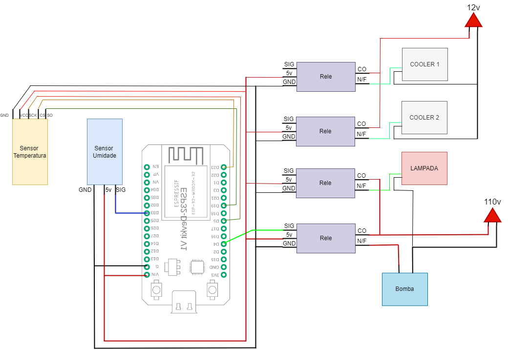

# PROJETO ESTUFA

Este projeto tem como objetivo o desenvolvimento de uma estufa automatizada. Esta estufa permite o monitoramento da umidade do solo e da temperatura ambiente dentro da estufa. Com base nos valores lidos pelos sensores é acionado os atuadores (Cooler de Exaustão, Cooler de Ventilação e Bomba d'água) e pode-se ligar/desligar a lâmpada para iluminação da estufa.

# Materiais e tecnologias

Este projeto utiliza os seguintes materiais:

- ESP32;
- Sensor de Temperatura (Max6675);
- Sensor de Umidade (Capacitive Soil Moisture Sensor v2.0);
- Lâmpada LED 110v;
- 2x Cooler 12v;
- Bomba d'água (Aquário) 110v;
- Protoboard e jumpers;
- Módulos relés 5v;

Este projeto foi desenvolvido e projetado para ser executado com FreeRTOS (Free Real-Time Operating System) e com comunicação MQTT (Message Queuing Telemetry Transport).

Este projeto também necessíta da utilização do aplicativo Iot MQTT Panel (Disponível na playStore).

# Casos de Uso

Este projeto se destina ao monitoramento da estufa, para isso o sistema necessita estabelecer uma conexão Wi-Fi e com o broker MQTT. Após as conexões estarem habilitadas o sistema inicia o monitoramento, porém ainda é necessário que o usuário configure os setpoints para interação com os atuadores. 

Após iniciar todo o sistema e obter a conexão Wi-Fi e broker MQTT o usuário poderá interagir com o sistema configurando os setpoints de umidade e temperatura, bem como acionar/desligar o cooler de exaustão ou a lâmpada LED.

# MQTT

Para configuração do MQTT foi utilizado um broker instanciado em uma imagem docker (Eclipse-Mosquitto). Os tópicos necessários para este projeto são:

- topico_umidade [Publish]: tópico destinado a enviar os valores lidos pelo sensor de umidade;;
- topico_temperatura [Publish]: tópico destinado a enviar os valores lidos pelo sensor de temperatura;
- topico_set_umidade [Subscribe]: tópico destinado a configurar o setpoint de umidade;
- topico_set_temperatura [Subscribe]: tópico destinado a configurar o setpoint de temperatura;
- topico_set_cooler [Subscribe]: tópico destinado a acionar/desligar o cooler de exaustão;
- topico_set_lampada [Subscribe]: tópico destinado a acionar/desligar a lâmpada LED.

# FreeRTOS

Esta estufa utiliza o FreeRTOS para paralelismo das tarefas necessárias de monitoramento e interação com os atuadores. Este projeto foi desenvolvido em 3 tasks:

- TaskSensores: task responsável pela leitura dos sensores e pelo envio dos valores para as filas do rele e mqtt;
- TaskRele: task responsável pelo acionamento dos relés com base nos valores recebidos na fila do rele
- TaskMQTT: task responsável pelo envio de mensagens MQTT com base nos valores recebidos na fila mqtt.

Estas tasks foram sincronizadas utilizando semáforos e filas. A task do MQTT foi alocada no core 0 do ESP32 e as demais no core 1. Cada cor possui um semáforo para evitar execução paralela dentro do core.
A fila do rele é responsável por conter os pinos de acionamento e o estado do rele. A fila do mqtt é responsável por conter qual tópico e mensagem será enviada via MQTT.

# Protótipo

Logo abaixo há o circuito esquemático para o protótipo desenvolvido. É possível ver os sensores de temperatura e umidade, os relés de acionamento dos coolers ligados em uma fonte 12v e os relés de acionamento da lâmpada e bomba d'água ligados a uma fonte de 110v. 

Logo abaixo há o protótipo montado em uma caixa de papelão, pode-se ver em uma das imagens o circuito montado com os relés, esp32 e protoboard. Também pode-se ver o cooler de exaustão, cooler de ventilação com a bomba d'água e o interior com lâmpada LED e o vaso de planta. 

Logo abaixo há o protótipo para o APP MQTT criado usando o aplicativo IoT MQTT Panel. Pode-se ver os gráficos para que o usuário acompanhe o histórico de leitura dos sensores de umidade e temperatura. Também pode-se ver os botões para ON/OFF do cooler de exaustão e para a lâmpada LED. Há também dois inputs para configurar os setpoints de umidade e temperatura.

